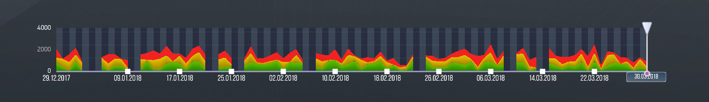

# AreaGraphControl
> Теги: 2D, функциональные, визуальные, управляющие элементы, отображение данных

Кнопка предназначена для вызова связанного события при её нажатии пользователем.

## Основное использование:

Следующий пример демонстрирует AreaGraphControl в действии:



Код примера, приведенного выше хранится в файле presentation.xml: 

```xml

```

## Свойства компонента:

Наследуются от [BaseGraphControl](../BaseGraphControl/README.md).


## События:

Наследуются от [BaseGraphControl](../BaseGraphControl/README.md).

## Команды:

| **Команда**        | **Параметры**                        | **Реакция компонента на команды**        |
| ------------------ | ------------------------------------ | ---------------------------------------- |
| **zoomin**         | -                                    | Растягивает график, увеличивая масштаб отображения по оси X. |
| **zoomout**        | -                                    | Сжимает график, уменьшаяет масштаб отображения по оси X. |
| **select**         | @SelectParamKey                      | Передвигает точку на оси X, тег которой соответствует переданному параметру, на правую границу видимой области. |
| **setlegendstate** | @LegendParamKey                      | Переключает видимость графика, соответствущего переданному параметру. |
| **setslider**      | @SliderParamKey                      | Показывает подписи значений графиков, соответствующих точке на оси X, тег которой соответствует переданному параметру. |
| **setlegendtext**  | @LegendParamKey, @LegendTextParamKey | Устанавливает переданный в @LegendTextParamKey текст в качестве подписи для легенды с идентификатором @LegendParamKey. |

## Схема компонента:




## Рекомендуемые ссылки:

* [Варианты использования AreaGraphControl](presentations.md)
* [Особенности и приемы работы с AreaGraphControl](hints.md)


