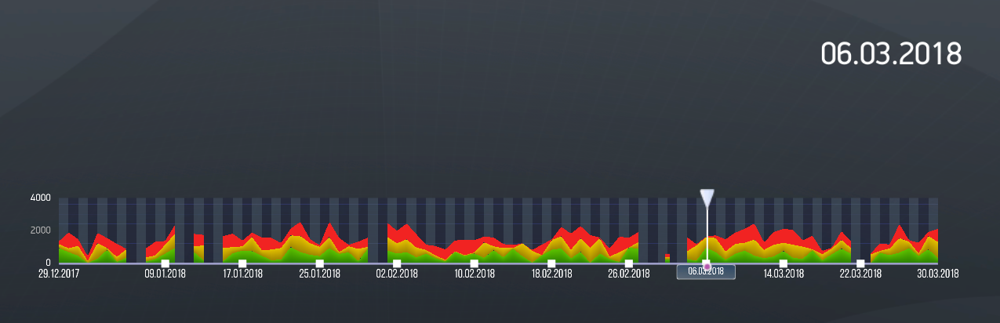

# Варианты использования AreaGraphControl 

## Передача выбранной даты в другой компонент

Передача выбранной даты в другой компонент позволяет формировать интерактивные  информеры. Ниже приведен элементарный пример передачи данных из AreaGraphControl в TextControl, который состоит из кода верстки размещения самого компонента AreaGraphControl, а также из кода хэндлера, который обрабатывает выбор даты и передачу ее для отображения в TextControl.



Код верстки компонента находится в файле presentation1.xml:

```xml

```

Код обработчика находится в файле areagraphhandler.xml:

```xml

```

## Рекомендуемые ссылки:

- [AreaGraphControl Основные сведения](README.md)
- [Особенности и приемы работы с AreaGraphControl](hints.md)

