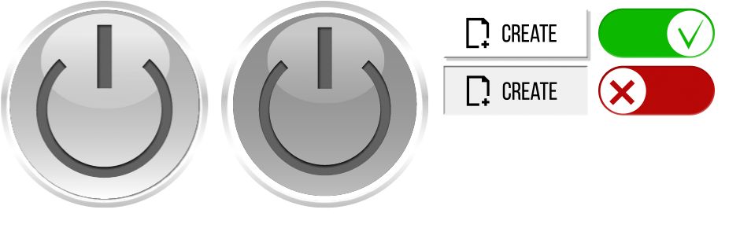

# Особенности и приемы работы с ButtonControl

## Использование свойства skin для различных состояний кнопки

Визуальное отображение кнопки (текстура) может задаваться как вложенным компонентом ImageControl так и свойством skin. При этом текстура хранится в 2х файлах:

1. Графический файл с несколькими вариантами текстур, соответствующие различным свойствам ButtonControl, который располагается в Assets\Resources\MyGUI_TExtures.



2. Файл skin.xml, содержащий текстурный атлас, определяющий области внутри графического файла, соответствующие определенным состояниям, который располагается в Assets\Resources.

```xml
<?xml version="1.0" encoding="UTF-8"?>
<MyGUI type="Resource" version="1.1">
     <Resource type="ResourceSkin" name="main_btn" size="264 263" texture="SKIN_IDVP_comp_01.png">
        <BasisSkin type="SubSkin" offset="0 0 264 263" align="Stretch">
            <State name="normal" offset="1 0 264 263"/>
            <State name="normal_checked" offset="281 1 264 263"/>
        </BasisSkin>
    </Resource>
    <Resource type="ResourceSkin" name="create_btn" size="188 68" texture="SKIN_IDVP_comp_01.png">
        <BasisSkin type="SubSkin" offset="0 0 188 68" align="Stretch">
            <State name="normal" offset="562 10 188 68"/>
            <State name="pushed" offset="562 83 188 68"/>
        </BasisSkin>
    </Resource>
    <Resource type="ResourceSkin" name="slider_on_off" size="148 64" texture="SKIN_IDVP_comp_01.png">
        <BasisSkin type="SubSkin" offset="0 0 148 64" align="Stretch">
            <State name="normal" offset="760 10 148 64"/>
            <State name="normal_checked" offset="760 83 148 64"/>
        </BasisSkin>
    </Resource>
</MyGUI>
```

## Рекомендуемые ссылки:

- [ButtonControl Основные сведения](README.md)
- [Варианты использования ButtonControl](presentations.md)


