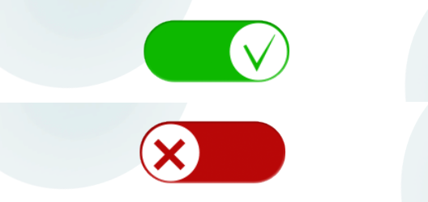

# Варианты использования ButtonControl 

Внешний вид ButtonControl определяется текстурой - картинкой, загружаемой из графического файла.
Текстура может значительно отличаться в зависимости от дизайна приложения.

Ниже приведено несколько оригинальных кнопок, которые показывают
разнообразие визуальных вариантов и помогут вам с идеями при создании дизайна собственного приложения.

## Объемная кнопка

Эффект трехмерности в кнопке достигается использованием в кнопке текстуры стилизированной под 3D, которая размещается внутри кнопки с помощью дополнительного вложенного компонента ImageControl.


```xml

```

## Кнопка-переключатель

Для создания кнопки-переключателя (toggle button) используется слудующий прием: одна под одной создается две кнопки сответсвенно с текстурой первого и второго состояния, которые при нажаитии меняют статус видлимости на противоположный. 




```xml

```

## Кнопка с текстом

Добавление текста в кнопку, например надписи "ОК" осуществляется размещением компонента TextControl внутри компонента ButtonControl.

Код этого примера.


## Рекомендуемые ссылки:

- [ButtonControl Основные сведения](README.md)
- [Особенности и приемы работы с ButtonControl](hints.md)