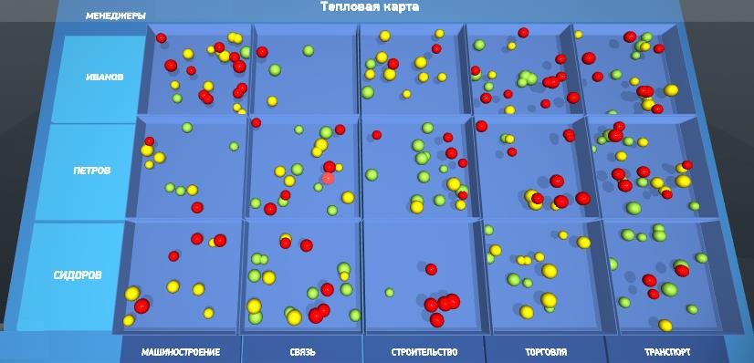

# HeatBubbleControl
> Теги: компонент, 3d, визуальные

Компонент, отображающий пузырьковую тепловую карту.

## Основное использование:

Следующий пример демонстрирует HeatBubbleControl в действии:



Код примера использования HeatBubbleControl:

```xml

```

HeatBubbleControl наследуется от Control.


## Свойства:

| **Свойство**                  | **Тип**                     | **Описание**                             |
| ----------------------------- | --------------------------- | ---------------------------------------- |
| **MainInfoButtonClickEvent**  | **Event**                   | Событие клика на главную информационную кнопку.|
| **BubbleDoubleClickEvent**    | **Event**                   | Событие двойного клика на шар.           |
| **RowCaptionClickEvent**      | **Event**                   | Событие клика на заголовок строки.       |
| **RowCaptionDblClickEvent**   | **Event**                   | Событие двойного клика на заголовок строки.|
| **ColumnCaptionClickEvent**   | **Event**                   | Событие клика на заголовок столбца.      |
| **InfoSignClickEvent**        | **Event**                   | Событие клика на значок с информацией.   |
| **OrderedColors**             | **[HeatBubbleColor](../HeatBubbleColor/README.md)**| Цвета, записанные в компоненте.          |
| **BackgroundColor**           | **[ColorARGB](../ColorARGB/README.md)**| Цвет подложки (?).                       |
| **InSourceID**                | string                      | Ссылка на компонент, создающий структуру данных внутри визуализатора.|
| **error**                     | string                      | Не используется в шаблонах, паразитное поле.|
| **BubbleCostMin**             | double                      | Минимальный порог стоимости заявки.      |
| **BubbleCostMax**             | double                      | Максимальный порог стоимости заявки.     |
| **EventParameternameBubbleID**| string                      | Название параметра, содержащего в себе идентификатор шара.|
| **EventParameternameCaptionID**| string                      | Название параметра, содержащего в себе название строки (?).|
| **EventParameternameColumnCaptionID**| string                      | Название параметра, содержащего в себе название столбца.|
| **EventParameternameBubbleList**| string                      | В шаблонах не используется.              |
| **EventParameternameBubbleCostMin**| string                      | Название параметра наименьшей стоимости шара.|
| **EventParameternameBubbleCostMax**| string                      | Название параметра наибольшей стоимости шара.|
| **EventParameterCellRow**     | string                      | Возвращает идентификатор выбранной строки.|
| **EventParameterCellColumn**  | string                      | Возвращает идентификатор выбранного столбца.|
| **ClearDepthOnly**            | boolean                     | Параметр встроенной в компонент камеры, отвечающий за прозрачность фона.|
| **ZOrder**                    | float                       | Параметр встроенной в компонент камеры, отвечающий за свойство ZOrder.|


## События:

| **Название события**          | **Условия возникновения**   | **Параметры**                            |
| ----------------------------- | --------------------------- | ---------------------------------------- |
| **MainInfoButtonClickEvent**  | Событие клика на главную информационную кнопку.| -                                        |
| **BubbleDoubleClickEvent**    | Событие двойного клика на шар.| -                                        |
| **RowCaptionClickEvent**      | Событие клика на заголовок строки.| -                                        |
| **RowCaptionDblClickEvent**   | Событие двойного клика на заголовок строки.| -                                        |
| **ColumnCaptionClickEvent**   | Событие клика на заголовок столбца.| -                                        |
| **InfoSignClickEvent**        | Событие клика на значок с информацией.| -                                        |


## Команды:

| **Команда**                   | **Параметры**               | **Реакция компонента на команду**        |
| ----------------------------- | --------------------------- | ---------------------------------------- |
| **setballsactive**            | ballscolor, activate        | Команда, регулирующая видимость шаров одной категории.|
| **set_balls_active**          | red, yellow, green          | Команда, регулирующая видимость шаров перечисленных категорий.|
| **updatedata**                | -                           | Команда обновления данных внутри компонента (а также инициализации работы).|
| **select_column**             | id столбца                  | Команда выбора стобца (остальные столбцы исчезают).|
| **deselect_column**           | id столбца                  | Команда сброса выделения столбца.        |
| **select_row**                | id строки                   | Команда выбора строки (остальные строки исчезают).|
| **deselect_row**              | id строки                   | Команда сброса выделения строки.         |
| **set_min_size**              | size                        | Команда установки минимального размера шара.|
| **set_max_size**              | size                        | Команда установки максимального размера шара.|
| **set_sizes**                 | -                           | Команда не используется.                 |


## Схема:

```xml
<xs:schema version="1.0" xmlns:xs="http://www.w3.org/2001/XMLSchema">
<xs:complexType name="HeatBubbleControl">
 <xs:complexContent>
  <xs:extension base="Control">
   <xs:sequence>
    <xs:element name="MainInfoButtonClickEvent" type="Event" />
    <xs:element name="BubbleDoubleClickEvent" type="Event" />
    <xs:element name="RowCaptionClickEvent" type="Event" />
    <xs:element name="RowCaptionDblClickEvent" type="Event" />
    <xs:element name="ColumnCaptionClickEvent" type="Event" />
    <xs:element name="InfoSignClickEvent" type="Event" />
    <xs:element maxOccurs="unbounded" minOccurs="0" name="OrderedColors" type="HeatBubbleColor" />
    <xs:element name="BackgroundColor" type="ColorARGB" />
   </xs:sequence>
   <xs:attribute default="Source" name="InSourceID" type="xs:string" />
   <xs:attribute default="" name="error" type="xs:string" />
   <xs:attribute default="0" name="BubbleCostMin" type="xs:double" />
   <xs:attribute default="5000000000" name="BubbleCostMax" type="xs:double" />
   <xs:attribute default="ApplicationId" name="EventParameternameBubbleID" type="xs:string" />
   <xs:attribute default="Parent_Group_Id_1" name="EventParameternameCaptionID" type="xs:string" />
   <xs:attribute default="Parent_Group_Id_2" name="EventParameternameColumnCaptionID" type="xs:string" />
   <xs:attribute default="bubblelist" name="EventParameternameBubbleList" type="xs:string" />
   <xs:attribute default="BubbleCostMin" name="EventParameternameBubbleCostMin" type="xs:string" />
   <xs:attribute default="BubbleCostMax" name="EventParameternameBubbleCostMax" type="xs:string" />
   <xs:attribute default="CellRow" name="EventParameterCellRow" type="xs:string" />
   <xs:attribute default="CellColumn" name="EventParameterCellColumn" type="xs:string" />
   <xs:attribute default="false" name="ClearDepthOnly" type="xs:boolean" />
   <xs:attribute default="-1" name="ZOrder" type="xs:float" />
  </xs:extension>
 </xs:complexContent>
</xs:complexType>
</xs:schema>
```


## Рекомендуемые ссылки:

* [Варианты использования HeatBubbleControl](presentations.md)
* [Особенности и приемы работы с HeatBubbleControl](hints.md)

