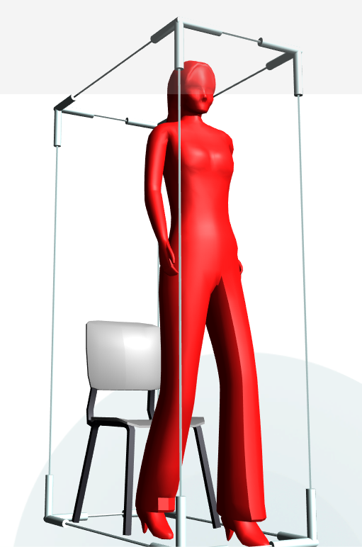

# Варианты использования MeshControl 

Внешний вид MeshControl определяется 3D моделью, которая загружена в него. Модели могут отличаться сложностью, материалами, цветами и размерами.

Ниже приведено несколько вариантов использования MeshControl. Варианты использования демонстрируют примеры загрузки различных моделей и несколько типичную реакций MeshControl на нажатие.

## Изменение цвета модели 



Код кейса хранится в файле MeshControl1.xml.

```xml
<MeshControl Model="Meshes/woman_with_chair1" KeepAspect="true" ColorerMode="ByMaterials">
  <Color A="255" R="255" G="0" B="0"/>
</MeshControl>
```

## Анимация камеры при нажатии на MeshControl

Кнопка с текстом ОК и небольшой иконкой вначале или рамкой вокруг

Код этого примера.


## Рекомендуемые ссылки:

- [MeshControl Основные сведения](../README.md)
- [Особенности и приемы работы с MeshControl](../README_hints.md)