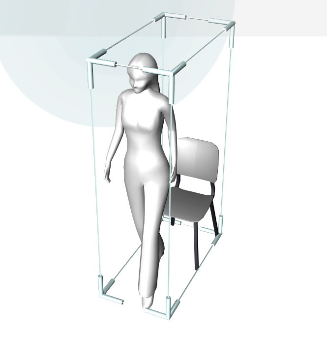

# MeshControl
> Теги: 3D, базовые, визуальные

Компонент для отображения трехмерных объектов.  

## Основное использование:

Следующий пример демонстрирует MeshControl в действии:



Код примера хранится в файле presentation.xml:

```xml

```

## Свойства компонента:

| **Свойство**   | **Тип**       | **Описание**                             |
| -------------- | ------------- | ---------------------------------------- |
| **Event**      | **Event**     | Событие, которое отправляется при клике в трехмерную модель (если она это поддерживает). |
| **Color**      | **ColorARGB** | Раскрашивает части модели в указанные цвета (если трехмерная модель это поддерживает). |
| **Model**      | string        | Название трехмерной модели.              |
| **KeepAspect** | boolean       | Отвечает за то, будет ли трехмерная модель сохранять свои порпорции, вписываясь в выделенную ей область для размещения. |

## События:

| **Название события** | **Условия возникновения**                | **Параметры** |
| -------------------- | ---------------------------------------- | ------------- |
| **Event**            | Клик по трехмерной модели (если трехмерная модель это поддерживает). | -             |

## Команды:

 Отсутствуют.

## Схема компонента:



## Рекомендуемые ссылки:

* [Варианты использования MeshControl](presentations.md)
* [Особенности и приемы работы с MeshControl](hints.md)

