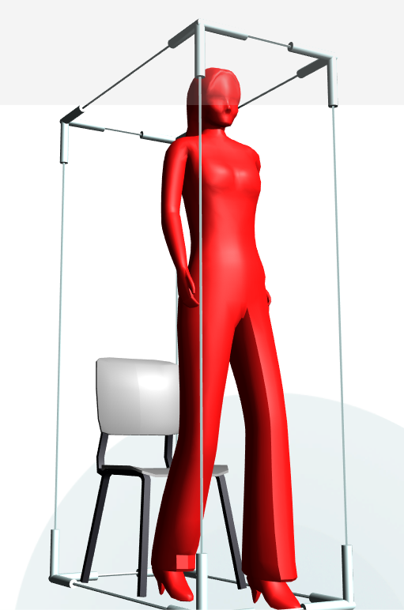

# Варианты использования MeshControl 

Внешний вид MeshControl определяется 3D моделью, которая загружена в него. Модели могут отличаться сложностью, материалами, цветами и размерами.

Ниже приведено несколько вариантов использования MeshControl. Варианты использования демонстрируют примеры изменения цвета модели и типичную реакцию MeshControl на нажатие.

## Изменение цвета модели 



Код этого примера:

```xml

```

## Анимация камеры при нажатии на MeshControl


Код этого примера:

```xml

```


## Рекомендуемые ссылки:

- [MeshControl Основные сведения](README.md)
- [Особенности и приемы работы с MeshControl](hints.md)