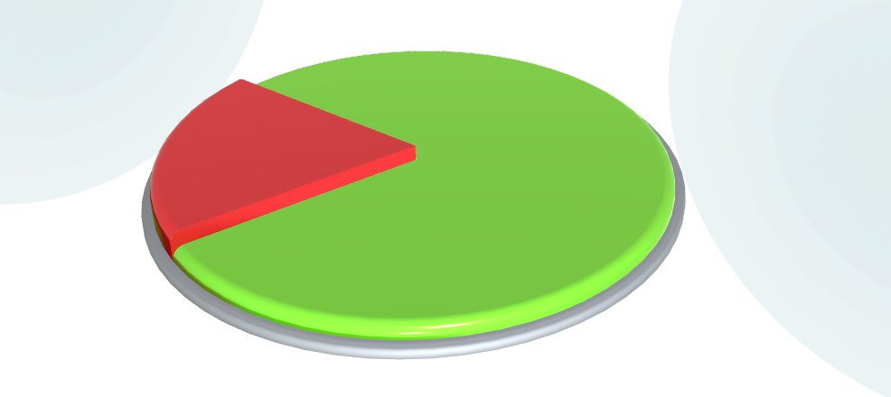

# PieChartControl
> Теги: 3D, визуальные, отображение данных, график/диаграмма

Компонент для создания круговой диаграммы.  

## Основное использование:

Следующий пример демонстрирует MeshControl в действии (женщина на стуле):



Код примера, приведенного выше. Файл piechartcontrol.xml.

```xml
<PieChartControl ID="RedGreenPie" Style="Gazprombank" Radius="1" Static="false">
    <Transform Width="100%" Height="10%"/>
    <PieChartSector Value="80">
         <Color A="255" R="96" G="204" B="20"/>
    </PieChartSector>
    <PieChartSector Value="20">
         <Color A="255" R="213" G="11" B="15"/>
    </PieChartSector>
</PieChartControl>
```

## Свойства компонента:

```xml
<xs:schema version="1.0" xmlns:xs="http://www.w3.org/2001/XMLSchema">
    <xs:complexType name="PieChartControl">
        <xs:complexContent>
            <xs:extension base="Control">
                <xs:sequence>
                    <xs:element name="Event" type="Event" minOccurs="0" />
                    <xs:element name="PieChartSector" type="PieChartSector" minOccurs="0" maxOccurs="unbounded" />
                </xs:sequence>
                <xs:attribute name="Radius" type="xs:float" use="required" />
            </xs:extension>
        </xs:complexContent>
    </xs:complexType>
    <xs:complexType name="PieChartSector">
        <xs:complexContent>
            <xs:extension base="ColorSector">
            </xs:extension>
        </xs:complexContent>
    </xs:complexType>
</xs:schema>
```


| **Свойство**        | **Тип**            | **Описание**                             |
| ------------------- | ------------------ | ---------------------------------------- |
| **PieChartControl** |                    | Список секторов.                         |
| **Event**           | **Event**          | Событие, которое отправляется при клике на сектор. |
| **PieChartSector**  | **PieChartSector** | Комплексный тип, который является расширением типа ColorSector. |
| **Radius**          | float              | Общий радиус компонента.                 |

## События:

| **Название события** | **Условия возникновения**                | **Параметры** |
| -------------------- | ---------------------------------------- | ------------- |
| **Event**            | Клик по трехмерной модели (если трехмерная модель это поддерживает). | -             |

## Команды:

 Отсутствуют.

## Рекомендуемые ссылки:

* [Варианты использования PieChartControl](.presentations/README.md)
* [Особенности и приемы работы с PieChartControl](README_hints.md)

