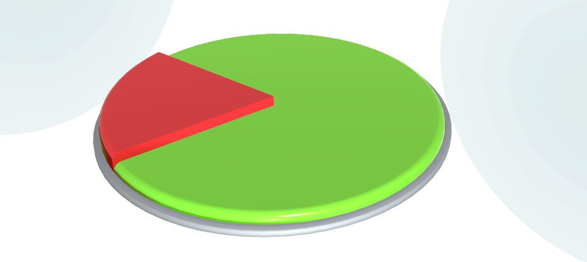

# PieChartControl
> Теги: 3D, визуальные, отображение данных, график/диаграмма

Компонент для создания круговой диаграммы.  

## Основное использование:

Следующий пример демонстрирует PieChartControl в действии:



Код примера, приведенного выше. 

```xml

```

## Свойства компонента:

| **Свойство**        | **Тип**            | **Описание**                             |
| ------------------- | ------------------ | ---------------------------------------- |
| **Event**           | **Event**          | Событие, которое отправляется при клике на сектор. |
| **PieChartSector**  | **PieChartSector** | Сектор (список).                         |
| **Radius**          | float              | Общий радиус компонента.                 |

#### Свойства PieChartSector:

| Свойство          | Тип          | Описание                                 |
| ----------------- | ------------ | :--------------------------------------- |
| **Value**         | float        | Размер сектора в процентах.              |
| **Color**         | **ColorARGB**| Цвет сектора включенного.                |
| **ColorDisabled** | **ColorARGB**| Цвет сектора выключенного.               |
| **enablesector**  | **команда**  | Включает сектор.                         |
| **disablesector** | **команда**  | Выключает сектор.                        |


## События:

| **Название события** | **Условия возникновения**                | **Параметры** |
| -------------------- | ---------------------------------------- | ------------- |
| **Event**            | Клик на секторе.                         | -             |

## Команды:

 Отсутствуют.

## Схема компонента:

```xml

```

## Рекомендуемые ссылки:

* [Варианты использования PieChartControl](presentations.md)
* [Особенности и приемы работы с PieChartControl](hints.md)

