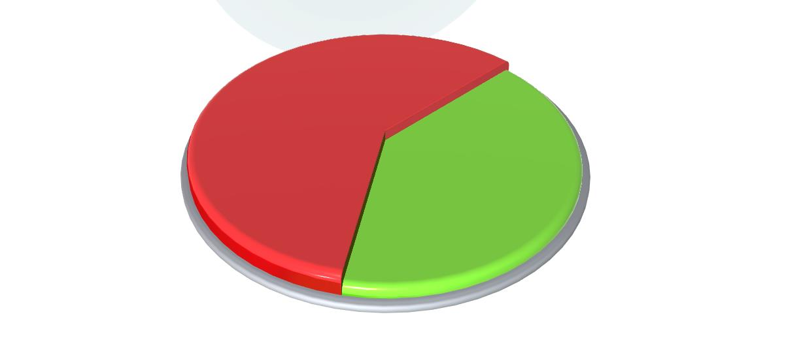

# Варианты использования PieChartControl 

## Размеры секторов PieChartControl берутся из таблицы



```xml

```

## Рекомендуемые ссылки:

- [PieChartControl Основные сведения](README.md)
- [Особенности и приемы работы с PieChartControl](hints.md)

