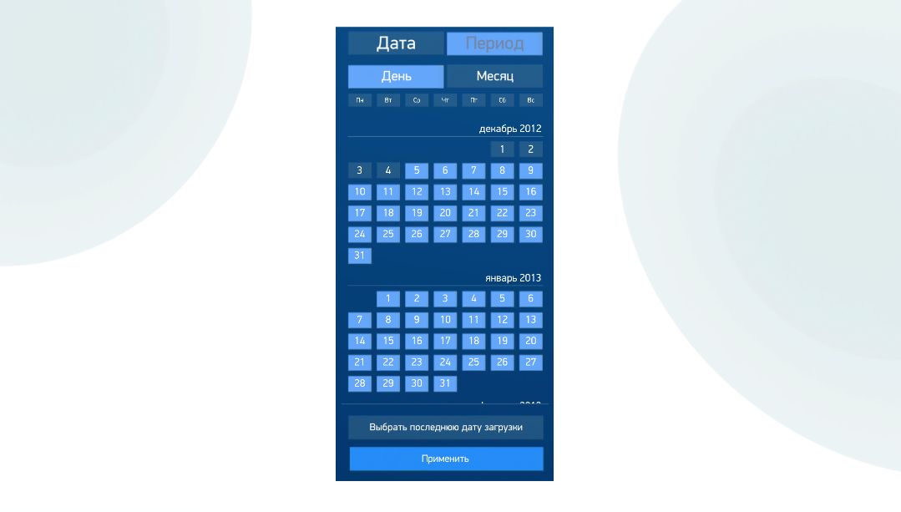

# RangeCalendarControl
> Теги: 2D, визуальные, ввод данных, календарь

Компонент для выбора даты или временного периода на календаре.  

## Основное использование:

Следующий пример демонстрирует RangeCalendarControl в действии.

Код примера, приведенного выше. Файл presentation.xml. 

```xml

```

## Свойства компонента:

| **Свойство**                  | **Тип**                                  | **Описание**                             |
| ----------------------------- | ---------------------------------------- | ---------------------------------------- |
| **RangeCalendarControl**      | ****                                     | Список элементов календаря.              |
| **DateSelectedEvent**         | **Event**                                |                                          |
| **MonthsLocalization**        | **CalendarRangeSelectorMonthsLocalizationData** |                                          |
| **DaysLocalization**          | **CalendarRangeSelectorDaysLocalizationData** |                                          |
| **QuarterLocalization**       | **CalendarRangeSelectorQuarterLocalizationData** |                                          |
| **DateCaption**               | string                                   | Текст кнопки режима выбора даты. По умолчанию: "Дата" |
| **PeriodCaption**             | string                                   | Текст кнопки режима выбора периода. По умолчанию: "Период" |
| **DayCaption**                | string                                   | Текст кнопки режима выбора дня. По умолчанию: "День" |
| **MonthCaption**              | string                                   | Текст кнопки режима выбора месяца. По умолчанию: "Месяц" |
| **ChooseLastLoadDateCaption** | string                                   | Текст кнопки выбора последней даты загрузки. По умолчанию: "Выбрать последнюю дату загрузки" |
| **ApplyCaption**              | string                                   | Текст кнопки применения. По умолчанию: "Применить" |
| **StartDateEventKey**         | string                                   | Имя параметра начальной даты.            |
| **EndDateEventKey**           | string                                   | Имя параметра конечной даты.             |
| **DateFormat**                | string                                   | Формат даты. По умолчанию "yyyy-MM-dd".  |
| **StartDate**                 | string                                   | Начальная дата.                          |
| **EndDate**                   | string                                   | Конечная дата.                           |
| **MinDate**                   | string                                   | Минимально допустимая дата.              |
| **MaxDate**                   | string                                   | Максимально допустимая дата.             |
| **LastLoadDate**              | string                                   | Последняя дата загрузки.                 |
| **HorizontalAlignment**       | **AlignmentType**                        | Горизонтальное выравнивание.             |
| **VerticalAlignment**         | **VerticalAlign**                        | Вертикальное выравнивание.               |
| **ActiveMode**                | **RangeCalendarActiveMode**              | Доступные режимы работы календаря. По умолчанию: "Both". |

### Описание типа CalendarRangeSelectorQuarterLocalizationData

| **Свойство**          | **Тип** | **Описание** |
| --------------------- | ------- | ------------ |
| **FirstQuarterName**  | string  |              |
| **SecondQuarterName** | string  |              |
| **ThirdQuarterName**  | string  |              |
| **FourthQuarterName** | string  |              |

### Состояния типа RangeCalendarActiveMode (Активные режимы календаря)

| **Значение**   | **Описание**           |
| -------------- | ---------------------- |
| **DateOnly**   | Только режим "Дата".   |
| **PeriodOnly** | Только режим "Период". |
| **Both**       | Оба режима активны.    |

## Команды:

 Отсутствуют.

## Схема компонента:



## Рекомендуемые ссылки:

* [Варианты использования RangeCalendarControl](presentations.md)
* [Особенности и приемы работы с RangeCalendarControl](hints.md)

