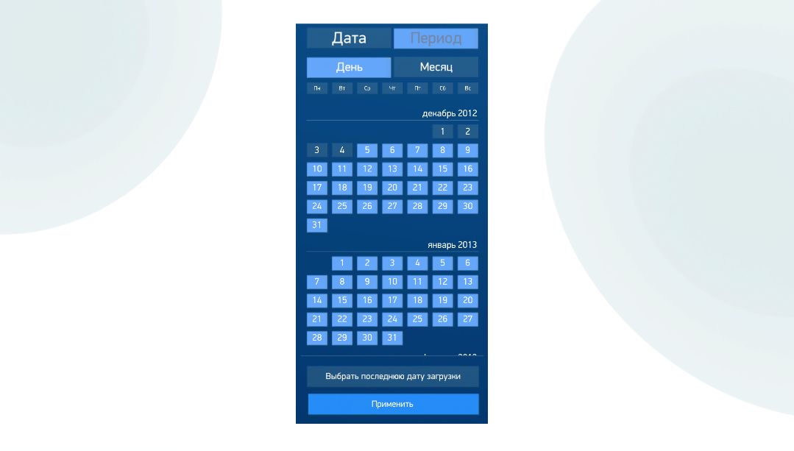

# RangeCalendarControl
> Теги: 2D, визуальные, ввод данных, календарь

Компонент для выбора даты или временного периода на календаре.  

## Основное использование:

Следующий пример демонстрирует RangeCalendarControl в действии.

Код примера, приведенного выше. Файл rangecalendarcontrol.xml (уточнить по необходимому коду, тут не однозначно что относиться к календарю). 

```xml
<StackPanelControl ID="CalendarPanel" Orientation="Vertical" Visible="true">
  <Transform VerticalAlignment="Center" Depth="10%" DepthAlignment="Front" HorizontalAlignment="Center" Width="100%" Height="100%"/>
  <ImageControl ID="11121212" Stretch="true" IsColored="true">
    <ImageColorARGB A="0" R="21" G="51" B="66"/>
    <Transform Height="7%" Margin="1% 0% 0% 0%"/>
  </ImageControl>
  <NineRectControl Skin="invisible" UseColorARGB="false" Width="100" Height="100" Stretch="true" Untouchable="false">
      <Transform Width="100%" Height="95%" Depth="10%" DepthAlignment="Front" HorizontalAlignment="Center"/>
      <RangeCalendarControl
          MinDate="2012-12-05"
          LastLoadDate="2017-01-01"
          StartDateEventKey="StartDate"
          EndDateEventKey="EndDate"
          HorizontalAlignment="Right">
          <Bind Name="LastLoadDate" Value="['2017-01-01']"/>
          <Bind Name="MaxDate" Value="[Now('yyyy-MM-dd')]"/>
          <Bind Name="StartDate" Value="['2012-12-05']"/>
          <Bind Name="EndDate" Value="['2017-01-01']"/>
          <Bind Name="ActiveMode" Value="['DateOnly']"/>
      </RangeCalendarControl>
  </NineRectControl>
</StackPanelControl>
```

## Свойства компонента:

| **Свойство**                  | **Тип**                                  | **Описание**                             |
| ----------------------------- | ---------------------------------------- | ---------------------------------------- |
| **RangeCalendarControl**      | ****                                     | Список элементов календаря.              |
| **DateSelectedEvent**         | **Event**                                |                                          |
| **MonthsLocalization**        | **CalendarRangeSelectorMonthsLocalizationData** |                                          |
| **DaysLocalization**          | **CalendarRangeSelectorDaysLocalizationData** |                                          |
| **QuarterLocalization**       | **CalendarRangeSelectorQuarterLocalizationData** |                                          |
| **DateCaption**               | string                                   | Текст кнопки режима выбора даты. По умолчанию: "Дата" |
| **PeriodCaption**             | string                                   | Текст кнопки режима выбора периода. По умолчанию: "Период" |
| **DayCaption**                | string                                   | Текст кнопки режима выбора дня. По умолчанию: "День" |
| **MonthCaption**              | string                                   | Текст кнопки режима выбора месяца. По умолчанию: "Месяц" |
| **ChooseLastLoadDateCaption** | string                                   | Текст кнопки выбора последней даты загрузки. По умолчанию: "Выбрать последнюю дату загрузки" |
| **ApplyCaption**              | string                                   | Текст кнопки применения. По умолчанию: "Применить" |
| **StartDateEventKey**         | string                                   | Имя параметра начальной даты.            |
| **EndDateEventKey**           | string                                   | Имя параметра конечной даты.             |
| **DateFormat**                | string                                   | Формат даты. По умолчанию "yyyy-MM-dd".  |
| **StartDate**                 | string                                   | Начальная дата.                          |
| **EndDate**                   | string                                   | Конечная дата.                           |
| **MinDate**                   | string                                   | Минимально допустимая дата.              |
| **MaxDate**                   | string                                   | Максимально допустимая дата.             |
| **LastLoadDate**              | string                                   | Последняя дата загрузки.                 |
| **HorizontalAlignment**       | **AlignmentType**                        | Горизонтальное выравнивание.             |
| **VerticalAlignment**         | **VerticalAlign**                        | Вертикальное выравнивание.               |
| **ActiveMode**                | **RangeCalendarActiveMode**              | Доступные режимы работы календаря. По умолчанию: "Both". |

### Описание типа CalendarRangeSelectorQuarterLocalizationData

| **Свойство**          | **Тип** | **Описание** |
| --------------------- | ------- | ------------ |
| **FirstQuarterName**  | string  |              |
| **SecondQuarterName** | string  |              |
| **ThirdQuarterName**  | string  |              |
| **FourthQuarterName** | string  |              |

### Состояния типа RangeCalendarActiveMode (Активные режимы календаря)

| **Значение**   | **Описание**           |
| -------------- | ---------------------- |
| **DateOnly**   | Только режим "Дата".   |
| **PeriodOnly** | Только режим "Период". |
| **Both**       | Оба режима активны.    |

## Команды:

 Отсутствуют.

## Рекомендуемые ссылки:

* [Варианты использования RangeCalendarControl](.presentations/README.md)
* [Особенности и приемы работы с RangeCalendarControl](README_hints.md)

