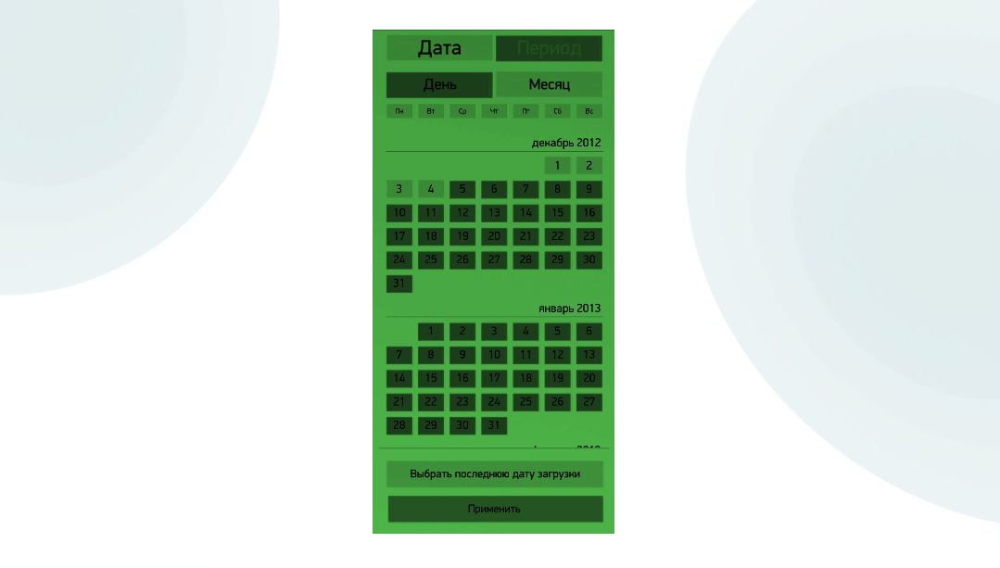

# Варианты использования RangeCalendarControl 

Внешний вид RangeCalendarControl определяется набором графических ресурсов, которые загружены в него.

## RangeCalendarControl с темно-зелеными кнопками на светло-зеленом фоне 



```xml

```


## Рекомендуемые ссылки:

- [RangeCalendarControl Основные сведения](README.md)
- [Особенности и приемы работы с RangeCalendarControl](hints.md)