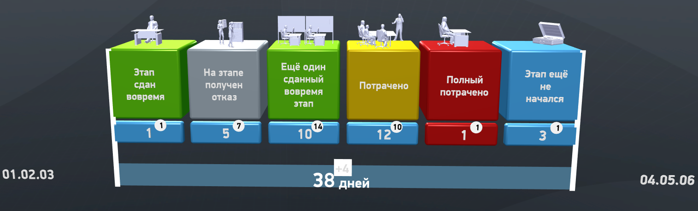

# RequestInfoStagesControl
> Теги: 3D, визуальные, сложная логика 

Визуальный компонент для отображения информации о состоянии выполнения KPI многоэтапного процесса в разрезе этапов.  

## Основное использование:

Следующий пример демонстрирует RequestInfoStagesControl в действии:

Код примера хранится в файле presentation.xml

 (необходимо определиться с системой хранения стилей, например сейчас подложка под +4 и боковые белые полоски хранятся в проекте газпром и не попали в сборку каталога, так же перепутаны шрифты).

```xml

```

## Свойства компонента:

| **Свойство**             | **Тип**                   | **Описание**                                                 |
| ------------------------ | ------------------------- | ------------------------------------------------------------ |
| **ProcessStagesList**    |                           | Список этапов процесса.                                      |
| **ProcessStage**         | **ProcessStage**          | Раскрашивает части модели в указанные цвета (если трехмерная модель это поддерживает). |
| **OnSelect**             | **Event**                 | Название трехмерной модели.                                  |
| **ParameterName**        | string                    | Имя параметра события.                                       |
| **Padding**              | float                     | Относительный отступ от границ контрола.                     |
| **RelativeColumnOffset** | float                     | Относительный отступ между столбцами.                        |
| **ProcessCondition**     | **ProcessStageCondition** | Состояние процесса в целом.                                  |
| **Overtime**             | int                       | Нормативное количество дней.                                 |
| **Duration**             | int                       | Фактичекое количество дней.                                  |
| **IsIndividual**         | boolean                   | Если true - не рисуем круги.                                 |
| **LeftText**             | string                    | Текст на плашке слева                                        |
| **RightText**            | string                    | Текст на плашке справа                                       |

### Описание типа **ProcessStage**

| **Свойство**       | **Тип**                   | **Описание**                                                 |
| ------------------ | ------------------------- | ------------------------------------------------------------ |
| **Id**             | int                       | Идентификатор этапа процесса.                                |
| **Name**           | string                    | Имя этапа процесса.                                          |
| **StandardTime**   | string                    | Нормативное количество дней.                                 |
| **ActualTime**     | string                    | Фактичекое количество дней.                                  |
| **StageCondition** | **ProcessStageCondition** | Состояние этапа. Принимает одно из предустановленных значений (см. ниже). |
| **StageModelId**   | int                       | ID 3D-модели, отображаемой на кубе этапа.                    |

### Состояния типа **ProcessStageCondition**

| **Значение**                | **Описание**                             |
| --------------------------- | ---------------------------------------- |
| **DoesntStartYet**          | Этап ещё не начался.                     |
| **InTime**                  | Этап в процессе работы или завершён в срок. |
| **DeadlineExceededWarning** | Срок превышен.                           |
| **DeadlineExceededCaution** | Срок сильно превышен.                    |
| **Denied**                  | Отказ.                                   |

## События:

 Отсутствуют.

## Команды:

 Отсутствуют.

## Схема компонента:

```xml 

```

## Рекомендуемые ссылки:

* [Варианты использования RequestInfoStagesControl](presentations.md)
* [Особенности и приемы работы с RequestInfoStagesControl](hints.md)

