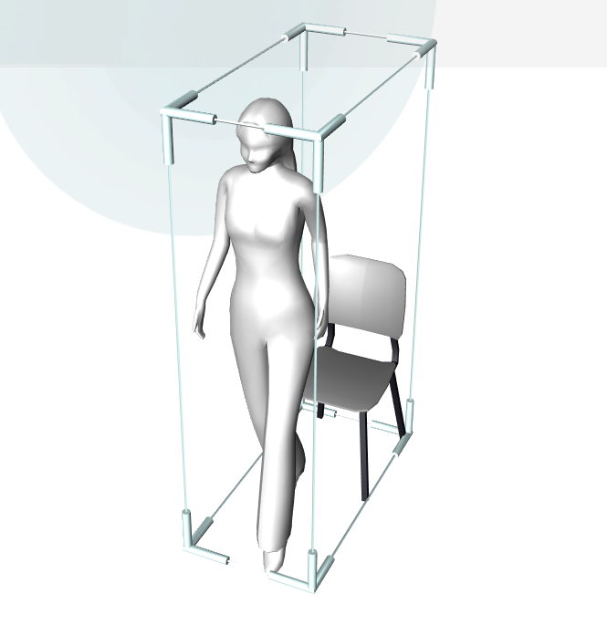

# Бибилиотека компонентов iDVP package-core
> Теги: 2D, 3D

Библиотека компонентов package-core включает базовые компоненты необходимые для разработки любого приложения iDVP.

Данная библиотека предоставляется всем разработчикам на платформе iDVP, также она включена в тестовый-доступ ареднаторов.

## Список компонентов:

Комментарий: Желательно, чтобы данная таблица формировалась автоматически, так как все ссылки на картинки и описания унифицированы и используют наименования контрола в названии.

| **Наименование**                         | **Визуальное отображение**               | **Описание**                             |
| ---------------------------------------- | ---------------------------------------- | ---------------------------------------- |
| [**ButtonControl**](ButtonControl/README.md) |  | Кнопка предназначена для вызова связанного события при её нажатии пользователем. |
| **[ImageControl](ImageControl/README.md)** |  | Компонент для отображения графических файлов. |
| **[MeshControl](MeshControl/README.md)** |  | Компонент для отображения трехмерных объектов. |
| **[TextControl](TextControl/README.md)** |  | Компонент для отображения текста на экране. |

